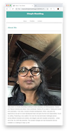

# Responsive-Portfolio
Basic Portfolio with the addition of Mobile responsiveness
# README for Responsive Portfolio

## Table of Contents

- [About Me](#aboutme)
- [Portfolio](#portfolio)
- [Contact](#contact)

## Tools Used

- [Visual Studio Code](#vscode)
- [Chrome Browser](#chrome)
- [GitLab](#gitlab)
- [GitHub](#github)
- [W3Schools](#w3schools)
- [SlackForum] (#slackforum)
- [Chrome plugin resizer] (#resizer)

## Core Technologies Used
 - [HTML] (#html)
 - [CSS] (#css)

# Details
- media queries for 980px,768px and 640px are implemented for each of the html pages.
- 768px will suit a tablet and 640px would equate to a mobile landscape screen size.

# What does 640px look like:
<!--  -->

